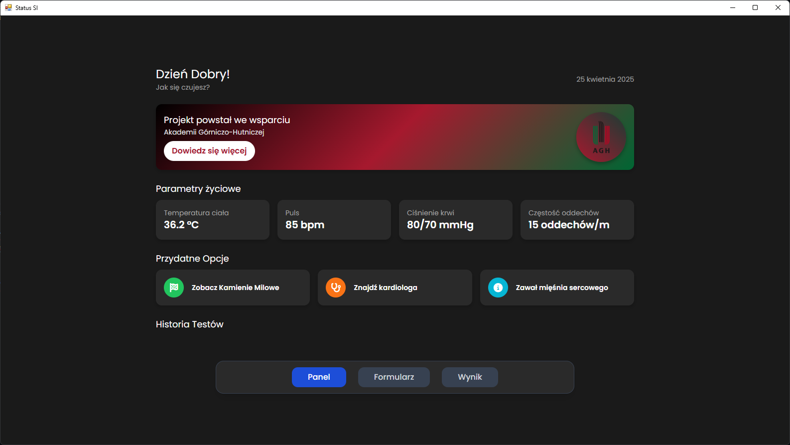
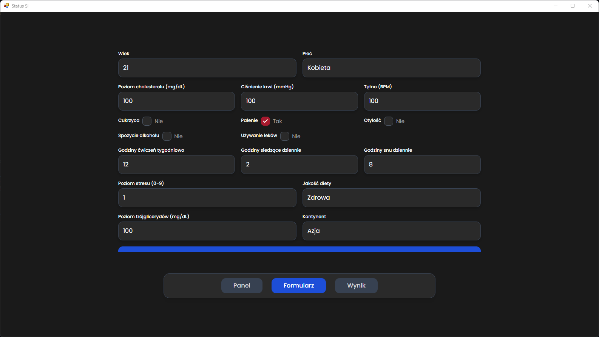
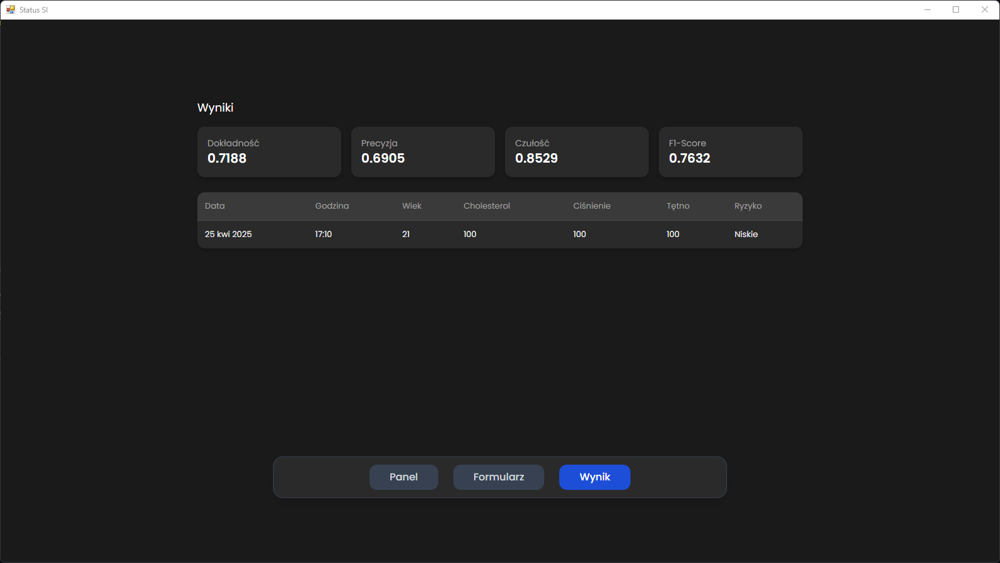
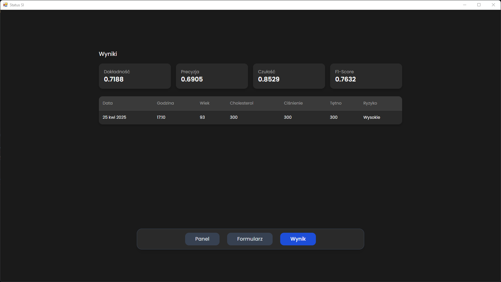

<center>

# Predykcja Ataku Serca z Modelem AI PyTorch / Heart Attack Prediction with PyTorch AI Model

</center>

[](https://www.python.org/) 
[](https://pytorch.org/)

---

## 🇵🇱 Wersja Polska

To repozytorium zawiera model AI oparty na PyTorch, przeznaczony do przewidywania ryzyka ataku serca na podstawie danych medycznych. Projekt obejmuje przetwarzanie danych, trenowanie modelu, ocenę oraz interfejs użytkownika zbudowany przy użyciu Flask i PyWebView.

### Funkcjonalności
- **Przetwarzanie Danych**: Obsługa brakujących wartości, skalowanie cech i normalizacja danych przy użyciu Pandas i Scikit-learn.
- **Model AI**: Sieć neuronowa zaimplementowana w PyTorch do klasyfikacji binarnej (ryzyko ataku serca).
- **Ocena Modelu**: Wizualizacja wyników modelu za pomocą metryk (dokładność, precyzja, czułość) oraz wykresów (macierz pomyłek, krzywa ROC).
- **Interfejs Webowy**: Przyjazny dla użytkownika interfejs oparty na Flask z PyWebView do wprowadzania danych i przeglądania predykcji.

### Wymagania
- Python 3.8 lub wyższy
- Zainstalowany Git do klonowania repozytorium
- Wymagane pliki: `model.pth`, `scaler.pkl` oraz `metrics.pkl` (jeśli dostępne)

### Instalacja
1. **Sklonuj Repozytorium**:
   ```bash
   git clone https://github.com/MichalGodPL/Podstawy_Sztucznej_Inteligencji.git
   ```
2. **Przejdź do Katalogu Projektu**:
   ```bash
   cd Podstawy_Sztucznej_Inteligencji
   ```
3. **Zainstaluj Zależności**:
   ```bash
   pip install torch numpy pandas scikit-learn matplotlib seaborn flask pywebview
   ```

### Uruchamianie
1. Upewnij się, że wymagane pliki (`model.pth`, `scaler.pkl`, `metrics.pkl`) znajdują się w katalogu projektu.
2. Uruchom główny skrypt:
   ```bash
   python Main.py
   ```
3. Skorzystaj z interfejsu webowego, aby wprowadzić dane pacjenta i zobaczyć predykcje.

### Ważne Uwagi
- Jeśli brak wymaganych plików, konieczne może być wcześniejsze wytrenowanie modelu (sprawdź repozytorium w poszukiwaniu skryptów treningowych).

---

## 🇬🇧 English Version

This repository contains a PyTorch-based AI model designed for heart attack prediction using medical data. The project includes data preprocessing, model training, evaluation, and a user-friendly interface built with Flask and PyWebView.

### Features
- **Data Preprocessing**: Handles missing values, feature scaling, and data normalization using Pandas and Scikit-learn.
- **AI Model**: A neural network implemented in PyTorch for binary classification (heart attack risk).
- **Evaluation**: Visualizes model performance with metrics (accuracy, precision, recall) and plots (confusion matrix, ROC curve).
- **Web Interface**: A Flask-based GUI with PyWebView for easy interaction and prediction input.

### Prerequisites
- Python 3.8 or higher
- Git installed for cloning the repository
- Required files: `model.pth`, `scaler.pkl`, and `metrics.pkl` (if available)

### Installation
1. **Clone the Repository**:
   ```bash
   git clone https://github.com/MichalGodPL/Podstawy_Sztucznej_Inteligencji.git
   ```
2. **Navigate to the Project Directory**:
   ```bash
   cd Podstawy_Sztucznej_Inteligencji
   ```
3. **Install Dependencies**:
   ```bash
   pip install torch numpy pandas scikit-learn matplotlib seaborn flask pywebview
   ```

### Usage
1. Ensure the required files (`model.pth`, `scaler.pkl`, `metrics.pkl`) are in the project directory.
2. Run the main script:
   ```bash
   python Main.py
   ```
3. Access the web interface to input patient data and view predictions.

### Important Notes
- If the required files are missing, you may need to train the model first (see the repository for training scripts).

---

## Zrzuty Ekranu / Screenshots





