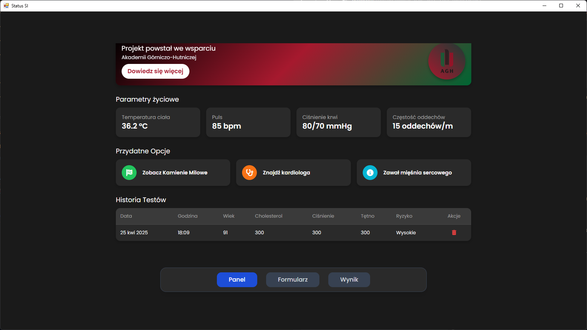

<div align="center">

# Heart Attack Prediction with PyTorch AI Model

</div>

<div align="center">

[](https://www.python.org/)
[](https://pytorch.org/)

</div>

---

## 🚀 Overview

This repository hosts a **PyTorch-based AI model** for predicting heart attack risk using medical data. It includes comprehensive data preprocessing, model training, evaluation, and a sleek web interface built with **Flask** and **PyWebView**. Available in **Polish** and **English**, this project is perfect for researchers, developers, and healthcare professionals exploring AI-driven solutions.

---

## 🇵🇱 Wersja Polska

### 🛠 Cechy Projektu

- **Przetwarzanie Danych**: Obsługuje brakujące wartości, skalowanie cech i normalizację danych z użyciem **Pandas** i **Scikit-learn**.

- **Model AI**: Sieć neuronowa w **PyTorch** do binarnej klasyfikacji ryzyka ataku serca.

- **Ocena Modelu**: Wizualizuje wyniki za pomocą metryk (dokładność, precyzja, czułość) oraz wykresów (macierz pomyłek, krzywa ROC).

- **Interfejs Użytkownika**: Intuicyjny interfejs webowy oparty na **Flask** i **PyWebView** do wprowadzania danych i przeglądania predykcji.

### 📋 Wymagania

- Python 3.8 lub nowszy

- Zainstalowany **Git** do klonowania repozytorium

- Pliki: `model.pth`, `scaler.pkl`, `metrics.pkl` (jeśli dostępne)

### 🔧 Instalacja

1. Sklonuj repozytorium:
   ```bash
   git clone https://github.com/MichalGodPL/Podstawy_Sztucznej_Inteligencji.git
   ```

2. Przejdź do katalogu projektu:
   ```bash
   cd Podstawy_Sztucznej_Inteligencji
   ```

3. Zainstaluj zależności:
   ```bash
   pip install torch numpy pandas scikit-learn matplotlib seaborn flask pywebview
   ```

### ▶️ Uruchamianie

1. Upewnij się, że pliki `model.pth`, `scaler.pkl` i `metrics.pkl` znajdują się w katalogu projektu.

2. Uruchom skrypt główny:
   ```bash
   python Main.py
   ```

3. Otwórz interfejs webowy, aby wprowadzić dane pacjenta i zobaczyć predykcje.

### ℹ️ Uwagi

- Jeśli brak wymaganych plików, konieczne może być wytrenowanie modelu. Sprawdź repozytorium w poszukiwaniu skryptów treningowych.

---

## 🇬🇧 English Version

### 🛠 Project Features

- **Data Preprocessing**: Handles missing values, feature scaling, and normalization using **Pandas** and **Scikit-learn**.

- **AI Model**: A **PyTorch** neural network for binary classification of heart attack risk.

- **Model Evaluation**: Visualizes performance with metrics (accuracy, precision, recall) and plots (confusion matrix, ROC curve).

- **Web Interface**: A user-friendly GUI built with **Flask** and **PyWebView** for inputting data and viewing predictions.

### 📋 Prerequisites

- Python 3.8 or higher

- **Git** installed for cloning the repository

- Required files: `model.pth`, `scaler.pkl`, and `metrics.pkl` (if available)

### 🔧 Installation

1. Clone the repository:
   ```bash
   git clone https://github.com/MichalGodPL/Podstawy_Sztucznej_Inteligencji.git
   ```

2. Navigate to the project directory:
   ```bash
   cd Podstawy_Sztucznej_Inteligencji
   ```

3. Install dependencies:
   ```bash
   pip install torch numpy pandas scikit-learn matplotlib seaborn flask pywebview
   ```

### ▶️ Usage

1. Ensure `model.pth`, `scaler.pkl`, and `metrics.pkl` are in the project directory.

2. Run the main script:
   ```bash
   python Main.py
   ```

3. Access the web interface to input patient data and view predictions.

### ℹ️ Notes

- If required files are missing, you may need to train the model. Check the repository for training scripts.

---

## 📸 Screenshots

<div style="display: grid; grid-template-columns: repeat(auto-fit, minmax(250px, 1fr)); gap: 20px; padding: 20px;">
  
  
  
  
  
  
</div>

---